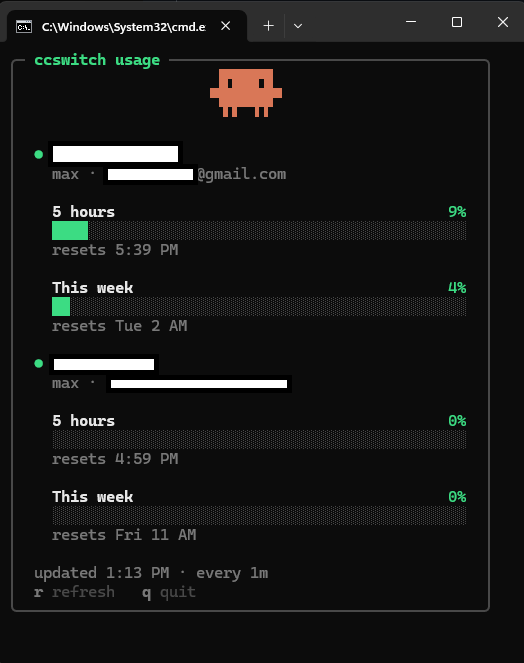

# claude-code-profiles

Switch between multiple Claude Code accounts without logging out. A terminal
picker that gives each account its own isolated config directory.


## Install

**Windows, no Go needed.** Downloads the prebuilt `.exe` from the latest
release and adds it to your PATH:

```powershell
irm https://raw.githubusercontent.com/NotAProgrammer187/claude-code-profiles/main/install.ps1 | iex
```

Then open a new terminal and run `ccswitch`. (Prefer not to pipe a script?
Grab `ccswitch.exe` from the
[Releases page](https://github.com/NotAProgrammer187/claude-code-profiles/releases)
and put it anywhere on your PATH.)

Using [Scoop](https://scoop.sh)? The manifest lives in this repo, so no bucket
is needed — and `scoop update ccswitch` handles updates from then on:

```powershell
scoop install https://raw.githubusercontent.com/NotAProgrammer187/claude-code-profiles/main/scoop/ccswitch.json
```

**macOS / Linux.** Downloads the matching prebuilt binary and installs it to
`~/.local/bin/ccswitch`:

```sh
curl -fsSL https://raw.githubusercontent.com/NotAProgrammer187/claude-code-profiles/main/install.sh | sh
```

(Or grab `ccswitch-darwin-arm64`, `ccswitch-darwin-amd64`, or
`ccswitch-linux-amd64` from the
[Releases page](https://github.com/NotAProgrammer187/claude-code-profiles/releases)
yourself, `chmod +x` it and move it onto your PATH.) On macOS, credential
isolation is partial (see below).

Using [Homebrew](https://brew.sh)? This repo doubles as a tap — the formula
picks the right binary for macOS (Intel or Apple Silicon) and Linux:

```sh
brew tap notaprogrammer187/ccswitch https://github.com/NotAProgrammer187/claude-code-profiles
brew install notaprogrammer187/ccswitch/ccswitch
```

Both installers — and `ccswitch upgrade` — verify what they download against
the `SHA256SUMS` manifest published with each release before installing it.
The Scoop manifest and Homebrew formula pin the same hashes, and each release
updates them automatically. A ccswitch installed by a package manager belongs
to that manager: `ccswitch upgrade` says so and points you at `scoop update` /
`brew upgrade` instead of fighting it.

Neither ccswitch nor Claude Code will surprise you with an update, but you
also shouldn't have to go looking: at most once a day, a background check
notes the latest release of each, and the moment you're back at a prompt —
Claude Code exiting, the picker closing — a one-liner tells you what's newer
and the command that updates it. No launch ever waits on the check, and
setting `CCSWITCH_NO_UPDATE_CHECK=1` turns it off entirely.

**Build from source** — needs Go 1.22+, produces one static `.exe`:

```powershell
git clone https://github.com/NotAProgrammer187/claude-code-profiles
cd claude-code-profiles
.\build.ps1 -Install
```

## Usage

| | |
|---|---|
| `ccswitch` | open the picker |
| `ccswitch run work` | launch straight into a profile |
| `ccswitch run` | launch the profile this directory is linked to (see below) |
| `ccswitch run work -- --resume` | anything after `--` is passed to `claude` |
| `ccswitch run --best` | launch the signed-in account with the most rate-limit headroom |
| `ccswitch use work` | pin the current shell to a profile (see below) |
| `ccswitch init pwsh` | shell integration: `use` applies itself, plus tab completion |
| `ccswitch link work` | use this profile for the current directory and below |
| `ccswitch unlink` | drop this directory's link |
| `ccswitch links` | list linked directories |
| `ccswitch usage` | show each account's rate-limit usage |
| `ccswitch usage --watch` | live usage panel to park beside Claude Code (see below) |
| `ccswitch sync --from work` | copy shared config into your other profiles (see below) |
| `ccswitch defaults` | show the settings every profile shares (see below) |
| `ccswitch defaults set remoteControlAtStartup false` | share one setting with every profile, now and on first login |
| `ccswitch new work` | create an empty profile from the CLI |
| `ccswitch import work` | copy the current `~/.claude` into a new profile |
| `ccswitch rename old new` | rename a profile |
| `ccswitch rm work` | delete a profile (asks first; `-y` skips) |
| `ccswitch list` | print profiles |
| `ccswitch current` | print the profile this shell is set to |
| `ccswitch where work` | print a profile's config directory |
| `ccswitch doctor` | check the whole setup and say what to fix (see below) |
| `ccswitch upgrade` | update ccswitch to the latest release |

**First run:** press `i` to import the account you're already logged into (this
copies your existing `~/.claude` and `~/.claude.json`, so you keep settings, MCP
servers and history). Press `n` to add each further account — a new profile
starts empty and runs Claude Code's normal login flow the first time you launch
it. Everything the picker keys do is also a plain command (`new`, `import`,
`rename`, `rm`), so setup scripts and dotfiles can manage profiles without the
UI.

**In the picker:** press `/` to filter profiles by name or email, `1`–`9` to
jump straight to one, and `↑↓`/`⏎` to move and launch. The row your current
shell points at (if any) is tagged `◂ this shell`.

**Which account has headroom?** Signed-in rows also show how much of each
account's 5-hour and weekly rate limit is used (`5h 42% · wk 12%`), turning
amber at 70% and red — with the reset time — at 90%. `ccswitch usage` prints
the same numbers in the terminal. This reads the endpoint Claude Code's own
`/usage` screen uses, with each profile's existing token; it's display-only
(nothing is written or refreshed), and if the endpoint ever changes shape the
rows simply omit it.

Don't want to think about it at all? `ccswitch run --best` checks every
signed-in account and launches the one with the most headroom — an account's
score is its most-used window, since that's the one that will stop you first,
and it prints what it picked and why (`work has the most headroom (5h 12% ·
7d 30%)`). Accounts whose usage can't be read are skipped rather than guessed
at.

### A usage panel beside Claude Code

`ccswitch usage` answers the question once. `ccswitch usage --watch` keeps
answering it: open a second terminal next to Claude Code, run it there, and
leave it. Every signed-in account gets a meter for its 5-hour and weekly
windows, with the reset time under each.



Bars turn amber past 70% and red past 90% — the same thresholds the picker
uses, so the two views never disagree about what counts as getting close. And
because the panel is most useful when you're *not* looking at it, a window
crossing into the red also rings the terminal bell and posts a desktop
notification — a toast on Windows, Notification Center on macOS, `notify-send`
on Linux. One crossing is one alert: opening the panel on an account
already in the red shows red quietly, and a window has to drop back below 90%
before it will alert again. The
account your shell is pinned to is tagged `◂ shell`; a profile this directory
is linked to is tagged `◂ here`. Opus gets its own meter only once you've
actually used it, so plans without a separate Opus window don't show a
permanent 0%.

It refreshes every minute; `--every 30s` changes that, with a 15-second floor
because the endpoint is undocumented and shared with Claude Code itself. `r`
refreshes now, `q` quits. Narrow the window or shorten it and the panel drops
to one line per window automatically, so it stays readable in a thin column.

Profiles added while it's running are picked up on the next refresh — no
restart needed. Like the rest of the usage code it's display-only: each
profile's existing token is sent, nothing is written back, and an account whose
fetch fails shows a dim line instead of taking the panel down.

The character at the top idles on its own clock — it sits still most of the
time, glances around occasionally and stretches now and then, slowly enough to
sit in the corner of your eye without asking for attention. To put your own art
there instead, fill in `watchArt` in `cmd/ccswitch/watch.go` — one string per
line, centred in the accent colour, with any line too wide for the panel
dropped rather than wrapped.

### Your account, in Claude Code's status line

Claude Code's status line can name the account the session is running as —
useful the moment you have more than one. `ccswitch statusline` prints one
line shaped for the `statusLine` setting: profile, model, and both rate-limit
windows, amber at 70% and red (with the reset time) at 90%, the same
thresholds as everywhere else:

```
work · Opus 4.5 · 5h 42% · wk 12%
```

Wire it into every profile at once — this is exactly what `defaults` is for:

```powershell
ccswitch defaults set statusLine '{"type":"command","command":"ccswitch statusline"}'
```

(Or set that value in one profile's `settings.json` by hand.) The status line
runs the command constantly, so it never touches the network itself: the
numbers come from a small cache that a detached helper refreshes at most every
two minutes, and until the first refresh lands the line simply shows the
profile without numbers. Sessions launched without ccswitch work too — the
line reads the default `~/.claude` and labels itself `claude`.

`ccswitch run` launches one session; `ccswitch use` points the shell itself at
a profile, so every plain `claude` you type afterwards runs as that account. A
child process can't change its parent's environment, so — like nvm or direnv —
`use` prints the command and you eval it:

```powershell
# PowerShell
Invoke-Expression (ccswitch use work)
```

```sh
# bash / zsh (incl. Git Bash)
eval "$(ccswitch use work)"
```

The picker tags that shell's row `◂ this shell`, `ccswitch current` names it,
and `Invoke-Expression (ccswitch use --unset)` (or `eval "$(ccswitch use
--unset)"`) unpins the shell again. Auto-detection covers PowerShell and POSIX
shells; pass `--shell pwsh|cmd|bash|fish` to override.

### Skip the eval: shell integration

`ccswitch init` prints a shell function that does the eval for you, so plain
`ccswitch use work` pins the shell — and it adds tab completion for profile
names. Install it once:

```powershell
# PowerShell
ccswitch init pwsh | Add-Content $PROFILE
```

```sh
ccswitch init bash >> ~/.bashrc
ccswitch init zsh  >> ~/.zshrc
ccswitch init fish  > ~/.config/fish/conf.d/ccswitch.fish
```

Open a new shell and `ccswitch use work` applies immediately;
`ccswitch run <tab>` completes profile names, and `sync --only <tab>` completes
its parts. Everything except `use` is passed straight through to the same
binary, so nothing else changes. (In PowerShell, words starting with `-` are
claimed by PowerShell's own parameter completion, so flags aren't completed
there — commands, profiles and flag values are. cmd.exe has no functions to
hang this on, so it keeps pasting what `ccswitch use` prints.)

### Share config between profiles

Isolation is the point for credentials — it's also why a second account starts
with none of your setup. `ccswitch sync` copies the parts that aren't
account-specific from one profile into the others:

```powershell
ccswitch sync --from work                      # into every other profile
ccswitch sync --from work --to personal,side   # or just these
ccswitch sync --from work --only settings,mcp  # or just these parts
ccswitch sync --from work -n                   # preview, write nothing
```

It always prints what it would write and asks before doing it (`-y` skips the
prompt). The parts it knows about are `settings` (`settings.json`), `claude-md`
(`CLAUDE.md`), `commands`, `agents`, `skills`, `output-styles`, `hooks`, and
`mcp` — your MCP servers, merged into each target's `.claude.json` so that
file's own account identity, project state and history stay intact.

Credentials, history and per-machine caches aren't on that list and can't be
synced, so this never moves a login. Directories are merged, not mirrored: a
file only the target has is left alone. It's a copy, not a symlink — run it
again after you change something you want shared.

### Settings that follow you: `ccswitch defaults`

`sync` is a one-off copy, which is the wrong shape for preferences you never
want to think about again. Turn Remote Control off in one profile and the next
account you sign in to has it on, because an absent setting means "default" —
and a fresh profile has no settings at all. Share the key instead:

```powershell
ccswitch defaults set remoteControlAtStartup false
ccswitch defaults                  # what's shared, and which profiles differ
ccswitch defaults apply            # write it into every profile now
ccswitch defaults unset theme      # stop sharing (profiles keep what they have)
```

Shared keys live in `~/.ccswitch/settings.json` and are written into a profile's
`settings.json` every time ccswitch launches or pins it — including the first
launch of a brand-new profile, before Claude Code's login flow runs. So the
setting is already in place for the session where you'd otherwise notice it was
missing. Setting one applies it everywhere immediately; after that, launches
that change nothing say nothing.

Any top-level `settings.json` key works (`remoteControlAtStartup`,
`autoUploadSessions`, `theme`, `model`, `verbose`, …). Values are read as JSON
when they parse as JSON and as strings otherwise, so `false` is a boolean and
`dark` is `"dark"`; quote a block to share it whole:
`ccswitch defaults set env '{"FOO":"bar"}'`.

Two things worth knowing. A shared key stops being a per-profile choice — change
it in one profile's `/config` and the next launch puts the shared value back,
which is what sharing means; `unset` it if you want that key to vary again. And
only the keys you name are touched: everything else in each profile's
`settings.json` — its model, its permissions, its MCP allowances — is left
alone. If a profile's `settings.json` can't be parsed, ccswitch says so and
writes nothing rather than replacing it.

### When something's off: `ccswitch doctor`

`ccswitch doctor` answers "why isn't this working?" in one pass — one line per
check, each either fine or telling you what to do about it:

```
ccswitch 0.1.7 on windows/amd64

  ok    binary — ~\bin\ccswitch.exe
  ok    claude — ~\AppData\Roaming\npm\claude.cmd
  warn  environment — ANTHROPIC_API_KEY is set — ccswitch strips it at launch, but a plain `claude` will bill the key instead of using your login
  ok    storage — ~\.ccswitch
  ok    state — ~\.ccswitch\state.json
  ok    work — you@work.com, signed in
  FAIL  personal — settings.json does not parse — fix it by hand; ccswitch won't touch a file it can't read

1 problem, 1 warning.
```

It covers the claude binary being on PATH, environment variables that would
override your login or profiles, a second ccswitch install shadowing the one
you're running, `~/.ccswitch` sitting inside a cloud-synced folder (profiles
hold live OAuth tokens), our own state and shared-settings files, every
profile's `settings.json` / `.claude.json` / credentials parsing, two profiles
signed in to the same account (one set of rate limits — `--best` would count it
twice), and directory links pointing at profiles or directories that no longer
exist.

It's strictly read-only: nothing is repaired, moved or rewritten, so you can
run it while deciding what to do. Exit code 1 when it finds a real problem, so
scripts can gate on it.

## How it works

Claude Code keeps everything — credentials, `settings.json`, MCP servers,
`CLAUDE.md`, history — in one directory, chosen by the `CLAUDE_CONFIG_DIR`
environment variable. So a profile here is just a directory, and launching one
sets `CLAUDE_CONFIG_DIR` for that single child process before running `claude`.

Nothing is copied or overwritten on switch, so logins can't clobber each other,
accounts can run in parallel across terminals, and switching is instant.

Because a profile is just a directory, it works with **any account Claude Code
can sign into** — Pro, Max, Team, Enterprise, or an API key — with no change on
ccswitch's side; the plan is only read to label the row. And there's **no limit
on the number of profiles**: add as many as you like. Each one is a real,
separately-authenticated account, so this isolates logins — it does not create
extra capacity or get around any account's own usage limits or billing.

## Things worth knowing

- **Restart to switch.** A running session reads its config at startup;
  launching another profile starts a new process and won't change an open one.
- **`ANTHROPIC_API_KEY` overrides a subscription login.** ccswitch strips it (and
  `ANTHROPIC_AUTH_TOKEN`) from the child process and warns you when it sees them.
- **macOS is different.** Credentials live in the Keychain there, so isolation is
  less complete. This is built for Windows first.
- **Profiles hold live OAuth tokens.** Don't sync `.ccswitch` to cloud storage or
  commit it anywhere.
- **You are responsible for complying with Anthropic's Terms of Service and Usage
  Policy.** ccswitch doesn't bypass authentication or billing — each profile logs
  in normally through Claude Code's own flow. It only isolates config directories.

## Disclaimer

This is an independent, community project. It is **not affiliated with, endorsed
by, or sponsored by Anthropic**. "Claude" and "Claude Code" are trademarks of
Anthropic, PBC, used here only nominatively to describe what this tool
interoperates with.

ccswitch runs entirely on your machine, stores nothing on any server, ships no
Anthropic code, and does not circumvent Claude Code's authentication or billing.
Use of Claude Code through ccswitch remains subject to Anthropic's own Terms of
Service and Usage Policy, and complying with them is your responsibility.

## License

MIT — see [LICENSE](LICENSE). Provided "as is", without warranty of any kind.
