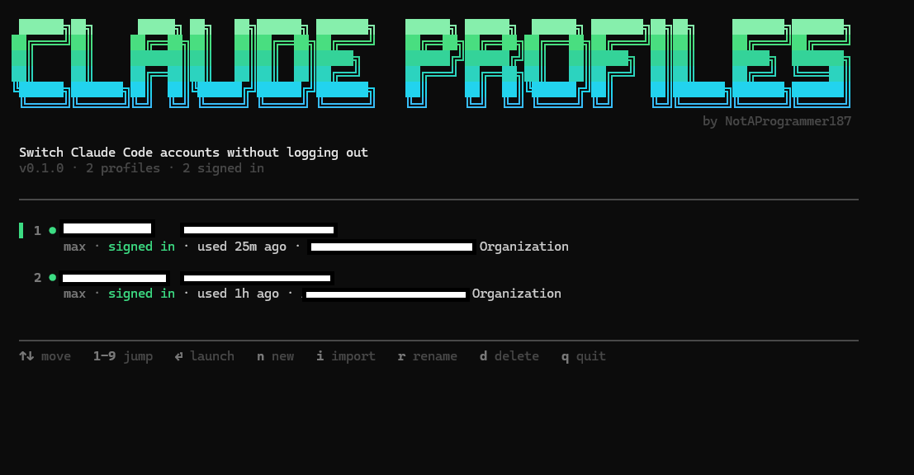

# claude-code-profiles

Switch between multiple Claude Code accounts without logging out. A terminal
picker that gives each account its own isolated config directory.



## Install

**Windows, no Go needed.** Downloads the prebuilt `.exe` from the latest
release and adds it to your PATH:

```powershell
irm https://raw.githubusercontent.com/NotAProgrammer187/claude-code-profiles/main/install.ps1 | iex
```

Then open a new terminal and run `ccswitch`. (Prefer not to pipe a script?
Grab `ccswitch.exe` from the
[Releases page](https://github.com/NotAProgrammer187/claude-code-profiles/releases)
and put it anywhere on your PATH.)

**macOS / Linux.** Download the matching binary from the
[Releases page](https://github.com/NotAProgrammer187/claude-code-profiles/releases)
— `ccswitch-darwin-arm64`, `ccswitch-darwin-amd64`, or `ccswitch-linux-amd64` —
then `chmod +x` it and move it onto your PATH (e.g. `~/bin`). On macOS, credential
isolation is partial (see below).

**Build from source** — needs Go 1.22+, produces one static `.exe`:

```powershell
git clone https://github.com/NotAProgrammer187/claude-code-profiles
cd claude-code-profiles
.\build.ps1 -Install
```

## Usage

| | |
|---|---|
| `ccswitch` | open the picker |
| `ccswitch run work` | launch straight into a profile |
| `ccswitch run work -- --resume` | anything after `--` is passed to `claude` |
| `ccswitch use work` | pin the current shell to a profile (see below) |
| `ccswitch usage` | show each account's rate-limit usage |
| `ccswitch sync --from work` | copy shared config into your other profiles (see below) |
| `ccswitch new work` | create an empty profile from the CLI |
| `ccswitch import work` | copy the current `~/.claude` into a new profile |
| `ccswitch rename old new` | rename a profile |
| `ccswitch rm work` | delete a profile (asks first; `-y` skips) |
| `ccswitch list` | print profiles |
| `ccswitch current` | print the profile this shell is set to |
| `ccswitch where work` | print a profile's config directory |
| `ccswitch upgrade` | update ccswitch to the latest release |

**First run:** press `i` to import the account you're already logged into (this
copies your existing `~/.claude` and `~/.claude.json`, so you keep settings, MCP
servers and history). Press `n` to add each further account — a new profile
starts empty and runs Claude Code's normal login flow the first time you launch
it. Everything the picker keys do is also a plain command (`new`, `import`,
`rename`, `rm`), so setup scripts and dotfiles can manage profiles without the
UI.

**In the picker:** press `/` to filter profiles by name or email, `1`–`9` to
jump straight to one, and `↑↓`/`⏎` to move and launch. The row your current
shell points at (if any) is tagged `◂ this shell`.

**Which account has headroom?** Signed-in rows also show how much of each
account's 5-hour and weekly rate limit is used (`5h 42% · wk 12%`), turning
amber at 70% and red — with the reset time — at 90%. `ccswitch usage` prints
the same numbers in the terminal. This reads the endpoint Claude Code's own
`/usage` screen uses, with each profile's existing token; it's display-only
(nothing is written or refreshed), and if the endpoint ever changes shape the
rows simply omit it.

### Pin a shell to a profile

`ccswitch run` launches one session; `ccswitch use` points the shell itself at
a profile, so every plain `claude` you type afterwards runs as that account. A
child process can't change its parent's environment, so — like nvm or direnv —
`use` prints the command and you eval it:

```powershell
# PowerShell
Invoke-Expression (ccswitch use work)
```

```sh
# bash / zsh (incl. Git Bash)
eval "$(ccswitch use work)"
```

The picker tags that shell's row `◂ this shell`, `ccswitch current` names it,
and `Invoke-Expression (ccswitch use --unset)` (or `eval "$(ccswitch use
--unset)"`) unpins the shell again. Auto-detection covers PowerShell and POSIX
shells; pass `--shell pwsh|cmd|bash|fish` to override.

### Share config between profiles

Isolation is the point for credentials — it's also why a second account starts
with none of your setup. `ccswitch sync` copies the parts that aren't
account-specific from one profile into the others:

```powershell
ccswitch sync --from work                      # into every other profile
ccswitch sync --from work --to personal,side   # or just these
ccswitch sync --from work --only settings,mcp  # or just these parts
ccswitch sync --from work -n                   # preview, write nothing
```

It always prints what it would write and asks before doing it (`-y` skips the
prompt). The parts it knows about are `settings` (`settings.json`), `claude-md`
(`CLAUDE.md`), `commands`, `agents`, `skills`, `output-styles`, `hooks`, and
`mcp` — your MCP servers, merged into each target's `.claude.json` so that
file's own account identity, project state and history stay intact.

Credentials, history and per-machine caches aren't on that list and can't be
synced, so this never moves a login. Directories are merged, not mirrored: a
file only the target has is left alone. It's a copy, not a symlink — run it
again after you change something you want shared.

## How it works

Claude Code keeps everything — credentials, `settings.json`, MCP servers,
`CLAUDE.md`, history — in one directory, chosen by the `CLAUDE_CONFIG_DIR`
environment variable. So a profile here is just a directory, and launching one
sets `CLAUDE_CONFIG_DIR` for that single child process before running `claude`.

Nothing is copied or overwritten on switch, so logins can't clobber each other,
accounts can run in parallel across terminals, and switching is instant.

Because a profile is just a directory, it works with **any account Claude Code
can sign into** — Pro, Max, Team, Enterprise, or an API key — with no change on
ccswitch's side; the plan is only read to label the row. And there's **no limit
on the number of profiles**: add as many as you like. Each one is a real,
separately-authenticated account, so this isolates logins — it does not create
extra capacity or get around any account's own usage limits or billing.

## Things worth knowing

- **Restart to switch.** A running session reads its config at startup;
  launching another profile starts a new process and won't change an open one.
- **`ANTHROPIC_API_KEY` overrides a subscription login.** ccswitch strips it (and
  `ANTHROPIC_AUTH_TOKEN`) from the child process and warns you when it sees them.
- **macOS is different.** Credentials live in the Keychain there, so isolation is
  less complete. This is built for Windows first.
- **Profiles hold live OAuth tokens.** Don't sync `.ccswitch` to cloud storage or
  commit it anywhere.
- **You are responsible for complying with Anthropic's Terms of Service and Usage
  Policy.** ccswitch doesn't bypass authentication or billing — each profile logs
  in normally through Claude Code's own flow. It only isolates config directories.

## Disclaimer

This is an independent, community project. It is **not affiliated with, endorsed
by, or sponsored by Anthropic**. "Claude" and "Claude Code" are trademarks of
Anthropic, PBC, used here only nominatively to describe what this tool
interoperates with.

ccswitch runs entirely on your machine, stores nothing on any server, ships no
Anthropic code, and does not circumvent Claude Code's authentication or billing.
Use of Claude Code through ccswitch remains subject to Anthropic's own Terms of
Service and Usage Policy, and complying with them is your responsibility.

## License

MIT — see [LICENSE](LICENSE). Provided "as is", without warranty of any kind.
